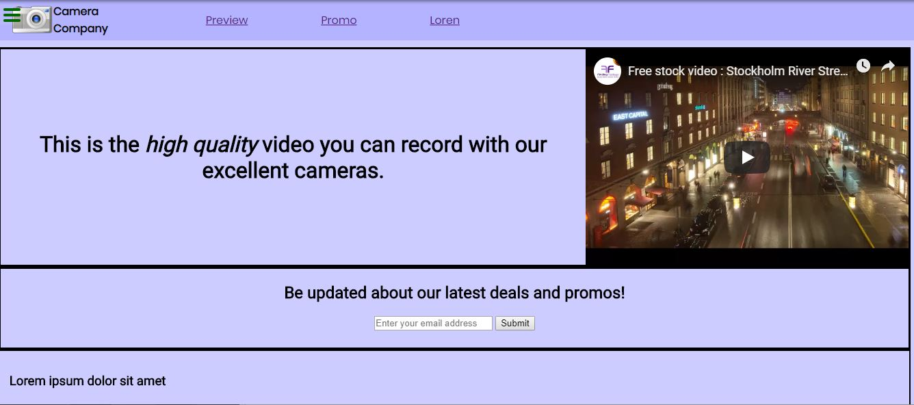

## Portfolio

---

### FreeCodeCamp.org	Responsive Web Design Curriculum

Project 1: [Tribute Page](https://codepen.io/dunemustier/full/qGyYVJ)

---
Project 2: [Survey Form](https://codepen.io/dunemustier/full/BeOrOG)

---
Project 3: [Product Landing Page](https://codepen.io/dunemustier/pen/pmQwVQ)

---

### Sample Articles

[Here is a Dropbox link](https://www.dropbox.com/sh/al1cellus4ggb4d/AABMswv6arVerhjpMSj8v0fua?dl=0) to a compilation of my written articles. It shows off a feature article, academic writing (excerpt from my thesis), an article about science and technology, and my original work of fiction (superhero genre) that I never got around to finishing.
